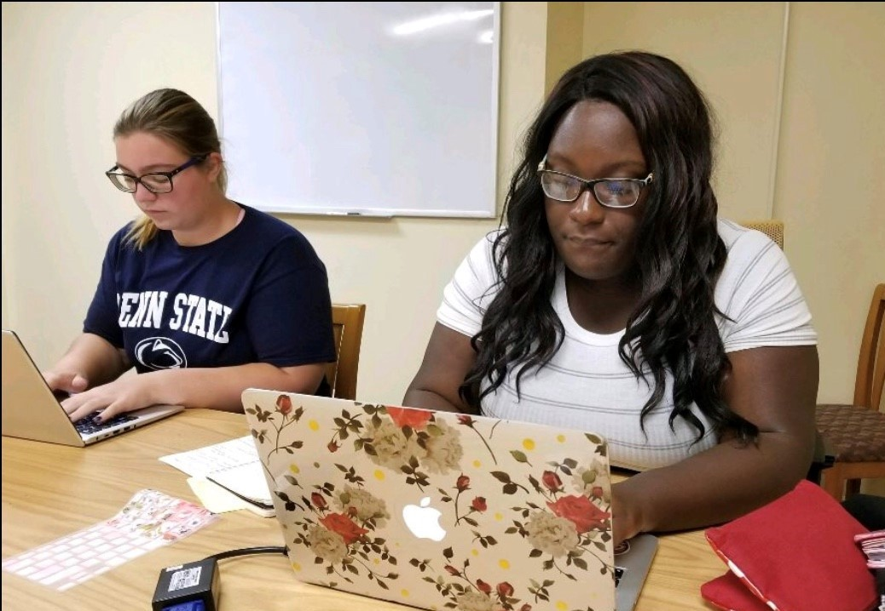
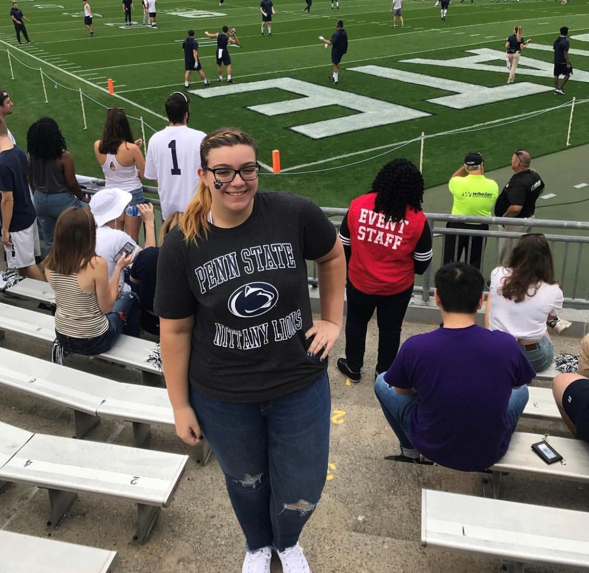
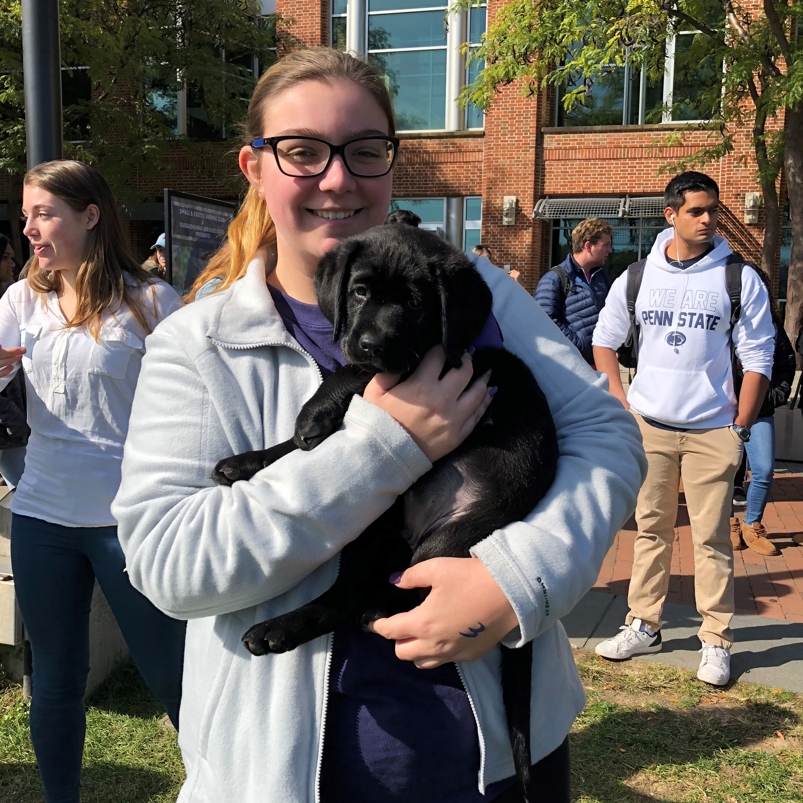
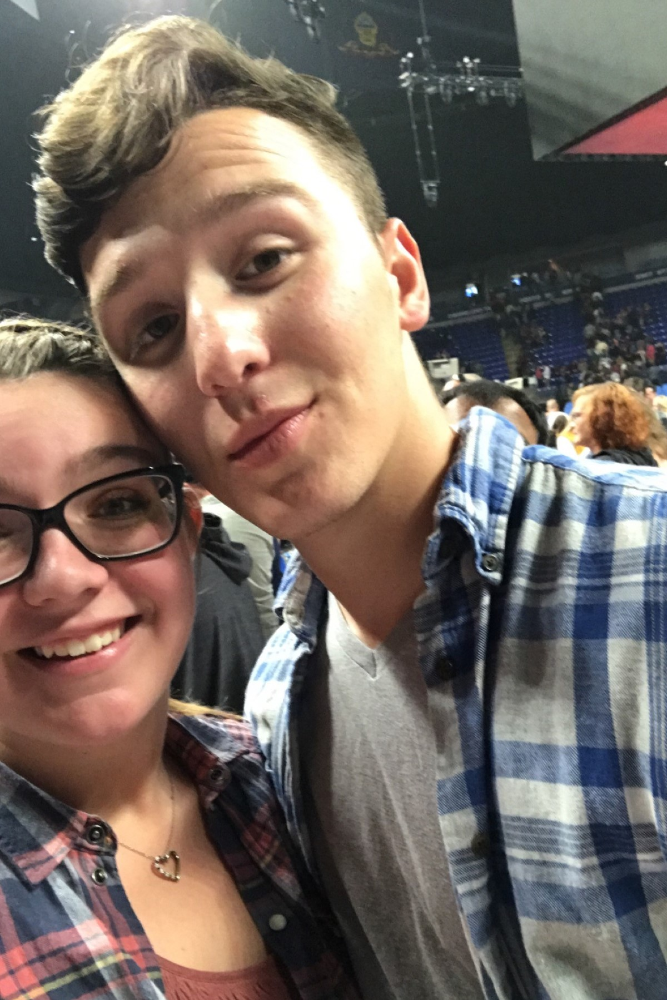

# Part 1) Join a club
##Which club did you choose to join, and why? What went on at the first meeting? (this can be brief!)  Was it worthwhile? Do you think you’ll remain involved? Why or why not?
I chose to join the Statistics club because I am a statistics major. At the first meeting, we discussed what the club is about and different opportunities and insights the club will provide us. I do not think I will remain involved because I am in the Bells club and wish to join the actuarial science club.

# Part 2) Go to 4 diverse events 
##Turn in a document showing a picture of you at the event and a few sentences describing your thoughts about each event:Why did you choose this event to attend? What did you think of the event? What did you get out of it?Are you glad you attended?  Why or why not?
###1) The Bells
This is another club that I chose to join. One of the friends I had made on my dorm floor, offered for me to be an officer on the board for a new club she was starting. The club is officially approved and I am the website and social media manager for it. The picture shows one of the executive meetings. I am glad I joined and i attended so I can meet new people and get a chance to volunteer at homeless shelters.

####

###2) Football Game
I had season tickets to attend the football games this season. I am glad I attended the games because it was fun to experience the student section and spend more time with friends. Meeting people with student tickets as well, brought me to be close friends with the people I am now. 
####
###3) Puppy Hugging Event
This event was at the Hub lawn, where you donated money to hug and take a picture with a puppy. I chose to attend this event because I had a week with a lot of exams and exam right before the event started. It was really nice to hug a puppy and destress from all the exams. 
####
###4) Kevin Hart
The last event I attended was the Kevin Hart show with my boyfriend from a different college. We both love his comedy, so we decided to get tickets. I am glad we attended because we laughed the whole time and got to destress from any big school projects and assignments. It was also nice to have a friend at my school and be able to show them around campus. Overall, the show was a lot of fun and it was nice to get out of the dorm room. 

####

